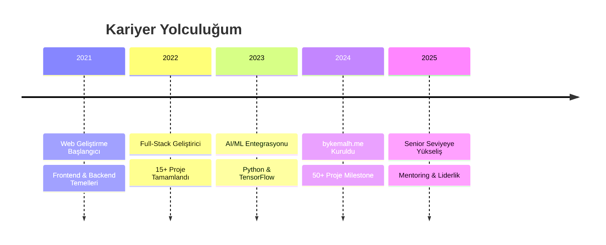

  

---

## 🚀 Hakkımda

> **"Modern teknolojilerle kullanıcı odaklı çözümler üretiyorum"**

🌟 **2021'den beri** web geliştirme ve yapay zeka alanında profesyonel çözümler sunuyorum  
⚡ **50+ proje** ile kapsamlı deneyim  
🎯 **Performans odaklı** ve **kullanıcı deneyimi** yüksek uygulamalar geliştiriyorum  
🤖 **Machine Learning** projeleri: ses tanıma, görüntü eşleştirme ve daha fazlası  

---

## 📊 GitHub İstatistiklerim

  

---

## 🛠️ Teknoloji Yığınım

### 💻 Frontend & UI

### ⚙️ Backend & API

### 🗄️ Veritabanı & DevOps

### 🤖 AI & Machine Learning

### 📱 Mobil & Desktop

---

## 📈 Aktivite Grafiği

---

## 🏆 GitHub Ödüllerim

  

---

## 🌟 Öne Çıkan Projeler

---

## 💼 Profesyonel Deneyim

---

## 🌍 Dil Yetkinlikleri

**🇹🇷 Türkçe** - Ana dil ████████████ 100%  
**🇺🇸 İngilizce** - Orta seviye ████████░░░░ 70%  
**🇷🇺 Rusça** - İleri seviye ██████████░░ 85%  

---

## 📊 Haftalık Kodlama İstatistikleri

<!--START_SECTION:waka-->
<!--END_SECTION:waka-->

---

## 🤝 Bağlantılar

---

### 💡 "Teknoloji ile hayatı kolaylaştırmak için buradayım!"

**© 2025 Kemal Hafızoğlu - Tüm hakları saklıdır.**
